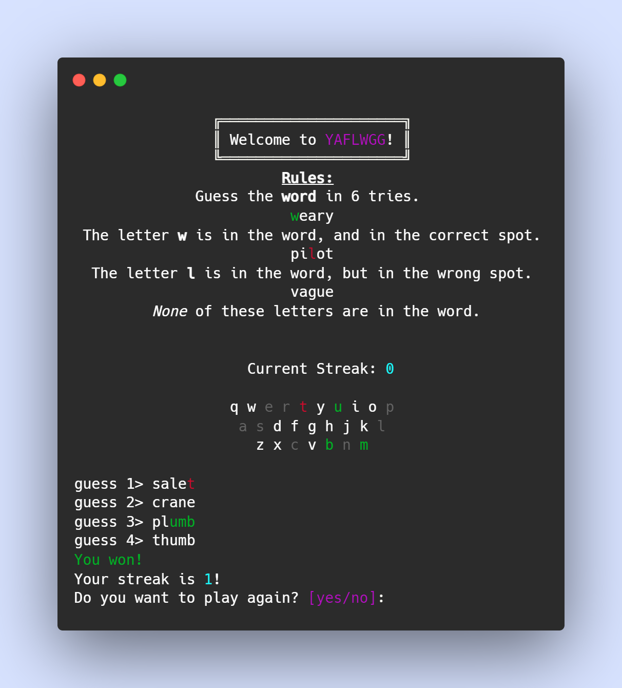

# Yet-Another-Five-Letter-Word-Guessing-Game
A Wordle clone in the terminal

This requires the Python library "rich"

`pip install rich`

As you enter words letters will come up either green, red or white inline.

## Commands
I have entered commands to play around with
`!hint`: will tell you a letter that is in the word, but not where it is.
`!give up`: will end the current game, and tell you the word.
